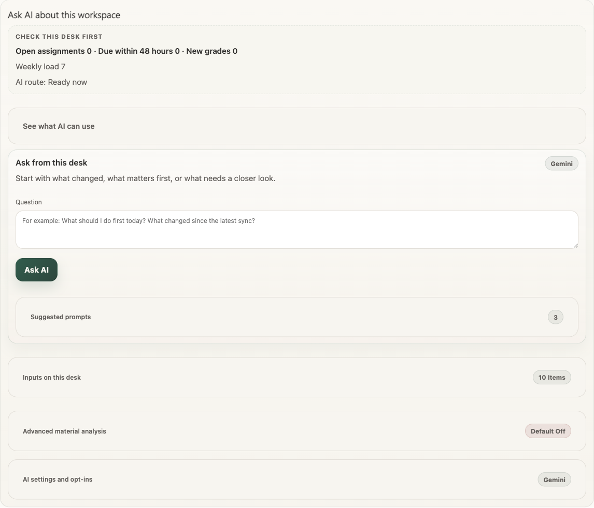
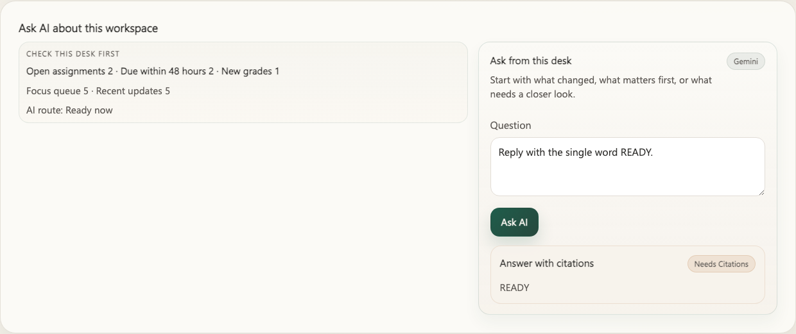
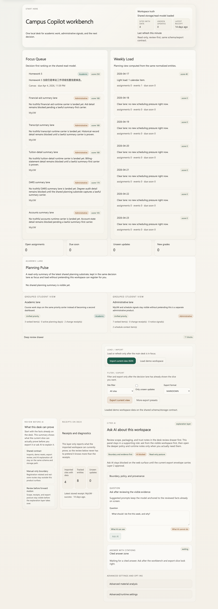

# OpenCampus

> OpenCampus keeps Canvas, Gradescope, EdStem, MyUW, and the current shipped read-only planning/admin desk on one local-first surface so students can see what changed, what matters first, and what to export or ask next.

> Campus Copilot is the first shipped workspace in that family. Today it is available as the `Campus Copilot for UW` browser extension plus a matching local web workbench.

[Docs](docs/README.md) · [Quickstart](#quickstart) · [User Surfaces](docs/06-export-and-user-surfaces.md) · [Security](SECURITY.md) · [Privacy](PRIVACY.md) · [Distribution](DISTRIBUTION.md)

## What You Can Try Today

- `Campus Copilot for UW` as the school-specific browser extension surface
- one local web workbench over the same read-only workspace
- manual sync, structured export, and cited AI after structure
- shipped read-only planning/admin surfaces for `MyPlan`, `DARS`, `Transcript`, `Financial aid`, `Accounts`, `Tuition detail`, `Profile`, and `Time Schedule`
- current shipped `courses.cs.washington.edu` (`CS only`) merge surfaces on the same course/work-item/resource desk
- a student-first product story before any builder or launch appendix

## Public Proof

Real product proof, not concept art:

These are public-proof crops of the current shipped surfaces.
They do not replace the deeper local installed-state or manual live review lane that stays documented in [`docs/storefront-assets.md`](docs/storefront-assets.md) and [`docs/live-validation-runbook.md`](docs/live-validation-runbook.md).


Extension proof: the current student-facing sidepanel with explicit `Export` and `Trust center` paths.


Ask AI proof: the AI lane still starts from the same desk, and empty desks route students back to workspace or export before a blank chat pretends to know enough.


Ask AI answer proof: the answer card still stays on the same desk, with citations/provenance visible instead of pretending the chat lane became a second source of truth.

Standalone web workbench proof:


Web proof: the broader read-only workbench that stays on the same local workspace contract.

## Start Here In 60 Seconds

OpenCampus starts with one narrow promise: keep academic work legible before AI or automation.

1. Sync `Canvas`, `Gradescope`, `EdStem`, and `MyUW` into one workbench.
2. Open the workspace to see **what changed**, **what is still open**, and **what should come first**.
3. Export the same structured result or ask **cited AI** to explain it.

This repo is not a blank chat shell. It is a **student-first desk**: structure first, export and AI second.

## Why This Exists

Students should not have to rebuild the same mental map across multiple campus sites before they can think.

Campus Copilot exists to:

- normalize site facts into one shared schema
- keep the workspace local-first and read-only by default
- let export and cited AI follow the same structured evidence
- keep academic safety explicit instead of hand-wavy

The product stays intentionally narrow:

- **Structured data first**
- **User-controlled workspace by default**
- **AI after structure**
- **Academic safety contract**
- **Export as a first-class path**

See:

- [`docs/01-product-prd.md`](docs/01-product-prd.md)
- [`docs/06-export-and-user-surfaces.md`](docs/06-export-and-user-surfaces.md)
- [`docs/07-security-privacy-compliance.md`](docs/07-security-privacy-compliance.md)
- [`PRIVACY.md`](PRIVACY.md)

## What Changes After The First Sync

After a real sync, the product should feel simpler, not busier:

- `Focus Queue`, `Weekly Load`, and `Change Journal` tell you what changed and what should come first
- export presets carry the same structured evidence into Markdown, CSV, JSON, or ICS
- cited AI explains the workspace instead of inventing a second source of truth
- if the desk is still too thin, Ask AI now sends you back to workspace or export instead of acting like a blank chat shell

## What To Do First

If you are new, follow this order:

1. Read this README as the student-facing front door.
2. Run the local workbench through [Quickstart](#quickstart).
3. Open the short docs router at [`docs/README.md`](docs/README.md).
4. Only then choose a deeper route: proof if you want receipts, builder docs if you need integration seams.

## Naming, Kept Simple

Use the names in this order:

- **OpenCampus** when you mean the repo-level public story
- **Campus Copilot** when you mean the current student workspace
- **Campus Copilot for UW** only when the school-specific extension label needs to stay explicit

## Current Product Shape

Today the repo already includes:

- a browser extension for `Canvas`, `Gradescope`, `EdStem`, and `MyUW`
- one local desk that keeps imported course and admin facts together
- shipped read-only planning/admin detail lanes for `MyPlan`, `DARS`, `Transcript`, `Financial aid`, `Accounts`, `Tuition detail`, `Profile`, and `Time Schedule`
- current shipped `Course Websites` (`CS only`) merge and authority surfaces inside the same shared workspace
- student-first extension surfaces with explicit `Assistant`, `Export`, and `Trust center` modes
- a read-only web workbench over the same local desk
- export presets for current view, weekly assignments, recent updates, deadlines, focus queue, weekly load, and change journal
- cited AI over structured workbench outputs
- a small local bridge for `OpenAI` and `Gemini` API-key flows
- optional builder routes after the student-facing product story

The honest split is:

- **student-facing workspace first**
- **proof receipts second**
- **builder/public routes only after the product story**
- **owner-side listing and launch later**

## Product Map


This illustration is the orientation map, not the proof lane. Keep using the screenshots and receipts above when you want evidence of the current shipped surface.

See the receipts:

- [`docs/assets/weekly-assignments-example.md`](docs/assets/weekly-assignments-example.md) shows an export-ready receipt
- [`examples/current-view-triage-example.md`](examples/current-view-triage-example.md) shows one current-view decision output

## Repo-Local Proof Path

Use this route when you want receipts after the product story is clear.

1. Start with [`docs/site-capability-matrix.md`](docs/site-capability-matrix.md) for the public capability snapshot.
2. Use [`docs/verification-matrix.md`](docs/verification-matrix.md) only when you want the deeper maintainer-facing verification registry after the product/proof story is already clear.
3. Treat [`docs/storefront-assets.md`](docs/storefront-assets.md) as a narrower proof appendix, not as the first explanation of the product.
4. Use [`DISTRIBUTION.md`](DISTRIBUTION.md) only for owner-side launch or listing truth, not as the main product explanation.

If you need the deeper appendix afterward, these receipts still exist without taking over the front door:

- [`docs/assets/weekly-assignments-example.md`](docs/assets/weekly-assignments-example.md)
- [`examples/current-view-triage-example.md`](examples/current-view-triage-example.md)
- [`examples/site-overview-audit-example.md`](examples/site-overview-audit-example.md)
- `pnpm proof:public`
- [`INTEGRATIONS.md`](INTEGRATIONS.md)
- [`examples/README.md`](examples/README.md)
- [`examples/toolbox-chooser.md`](examples/toolbox-chooser.md)
- [`examples/integrations/plugin-bundles.md`](examples/integrations/plugin-bundles.md)
- run a local Docker path with health checks through [`DISTRIBUTION.md`](DISTRIBUTION.md)

## Student Questions This Repo Tries To Answer

The product is designed around three recurring student questions:

- what is still open?
- what changed recently?
- what should I do first, and why?

Everything else on the public front door should support those questions instead of overshadowing them.

## Quickstart

### 1. Install dependencies

```bash
pnpm install
```

### 2. Start the local API and build the extension

```bash
pnpm start:api
pnpm build:extension
```

### 2b. Build the standalone web workbench

```bash
pnpm --filter @campus-copilot/web build
```

### 3. Load the unpacked extension

Load this directory in Chrome:

```text
apps/extension/dist/chrome-mv3
```

If you want AI responses from the sidepanel, Campus Copilot now first checks the usual local loopback addresses automatically:

```text
http://127.0.0.1:8787
http://localhost:8787
```

Only if autodiscovery fails do you need to open Trust Center and enter a manual local API address.

## Builder Quick Paths

Use this section only after the student-facing workspace story already makes sense.

- Start with [`docs/10-builder-api-and-ecosystem-fit.md`](docs/10-builder-api-and-ecosystem-fit.md). That file is the builder appendix, not the product pitch.
- For routing, use [`docs/api/openapi.yaml`](docs/api/openapi.yaml), [`examples/README.md`](examples/README.md), [`examples/toolbox-chooser.md`](examples/toolbox-chooser.md), and [`examples/integrations/README.md`](examples/integrations/README.md) before opening package-level detail.
- For deeper local-consumer examples only, continue to [`examples/mcp/README.md`](examples/mcp/README.md), [`examples/integrations/codex-mcp-shell.example.json`](examples/integrations/codex-mcp-shell.example.json), [`examples/integrations/claude-code-mcp-shell.example.json`](examples/integrations/claude-code-mcp-shell.example.json), [`examples/integrations/plugin-bundles.md`](examples/integrations/plugin-bundles.md), [`examples/openclaw-readonly.md`](examples/openclaw-readonly.md), [`packages/mcp-server/README.md`](packages/mcp-server/README.md), and [`skills/README.md`](skills/README.md).

## Boundaries

Formal product paths:

- read-only academic workflow
- shared student workspace and local decision views
- local user-state overlay and derived decision views
- manual sync from supported sites
- export from normalized data
- cited AI over structured results
- local API bridge for `OpenAI` and `Gemini` API-key flows

Not formal product paths:

- `web_session`
- automatic multi-provider routing
- write-capable campus automation
- `Register.UW` / `Notify.UW` automation, seat watching, or registration-related polling
- default AI ingestion of raw course files, instructor-authored materials, exams, or other copyright-sensitive course content

For the detailed public-safe wording and current boundary split, continue with:

- [`PRIVACY.md`](PRIVACY.md)
- [`INTEGRATIONS.md`](INTEGRATIONS.md)
- [`DISTRIBUTION.md`](DISTRIBUTION.md)
- [`docs/07-security-privacy-compliance.md`](docs/07-security-privacy-compliance.md)
