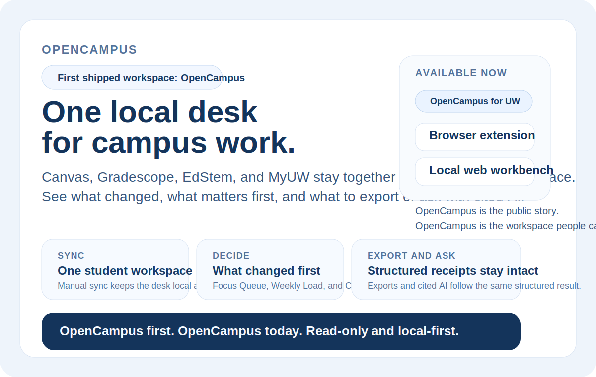
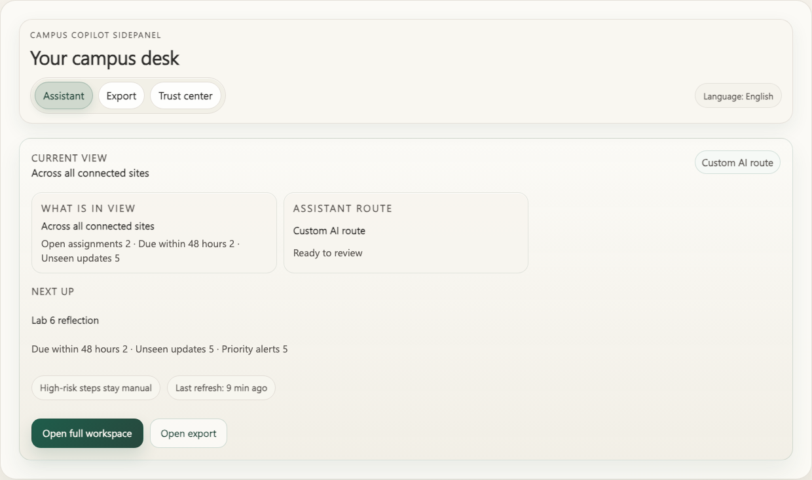

# Campus Copilot

> An academic decision workspace for students who want Canvas, Gradescope, EdStem, and MyUW in one structured place, then want clear answers to what changed, what matters first, and what to export or ask with cited AI.

[Docs](docs/README.md) · [Quickstart](#quickstart) · [Integrations](INTEGRATIONS.md) · [Distribution](DISTRIBUTION.md) · [Privacy](PRIVACY.md) · [Product Brief](docs/01-product-prd.md) · [Academic Safety](docs/17-academic-expansion-and-safety-contract.md) · [User Surfaces](docs/06-export-and-user-surfaces.md) · [Verification Matrix](docs/verification-matrix.md) · [Contributing](CONTRIBUTING.md) · [AI Collaboration](CLAUDE.md) · [Security](SECURITY.md) · [License](LICENSE)



Real workbench proof, not concept art:



## Start Here In 60 Seconds

Campus Copilot takes four campus sites and turns them into **one local workspace**.
The default student loop is:

1. sync `Canvas`, `Gradescope`, `EdStem`, and `MyUW` into one workbench
2. open the decision layer to see **what changed**, **what is still open**, and **what to do first**
3. export the same structured view or ask **cited AI** to explain it

That is the main story of the repo.
It is not "open a blank chat box and hope the model figures school out for you."

## Why This Exists

Campus Copilot is not a generic AI shell.

It is an **academic decision workspace** for students who want one place to answer questions like:

- What assignments are still open?
- What changed recently across my classes?
- What should I pay attention to first?

The product stays intentionally narrow:

- **Structured data first**: adapters normalize site-specific data into one shared schema.
- **User-controlled workspace by default**: storage, workbench views, filtering, and export stay on the student side instead of pretending this is a hosted school platform.
- **AI after structure**: AI can summarize or explain the workbench result, but it does not read raw DOM, raw HTML, cookies, or raw course files/instructor-authored materials by default. The only advanced material-analysis path currently allowed is still default-off, per-course, excerpt-only, and user-confirmed.
- **Academic safety contract**: read-only academic expansion beyond the current four-site sync core, including the current `Time Schedule` and `MyPlan` lanes, stays outside red-zone registration automation and other high-risk school actions.
- **Export is a first-class feature**: Markdown, CSV, JSON, and ICS are part of the core product, not an afterthought.

You can think of it like a school desk instead of a chat window:
first gather the papers into one pile, then mark what changed, then ask for help on top of that organized pile.

## What Changes After The First Sync

After the first real sync, the value is supposed to feel concrete:

- you stop hopping between four campus sites just to rebuild the same mental map
- `Focus Queue`, `Weekly Load`, and `Change Journal` tell you what changed and what should come first
- export presets carry the same structured evidence into Markdown, CSV, JSON, or ICS
- cited AI explains the same structured workspace instead of inventing its own hidden source of truth

## What To Do First

If you are new, follow this order:

1. **Understand the student-facing loop** in this README.
2. **Run the local workbench** through [Quickstart](#quickstart).
3. **Read the product contract** in [docs/01-product-prd.md](docs/01-product-prd.md), [docs/06-export-and-user-surfaces.md](docs/06-export-and-user-surfaces.md), and [docs/17-academic-expansion-and-safety-contract.md](docs/17-academic-expansion-and-safety-contract.md).
4. **Only after that**, use the proof and builder routes that match your intent.

That ordering matters.
Proof is there to verify the workbench is real.
Builder surfaces are there to consume the same substrate.
Neither should replace the student-first story on the front door.

## Pick The Right Entry Surface

If you only need the fastest truthful route, start here:

| If you are | Start here | Why this is the right first stop |
| :-- | :-- | :-- |
| a student trying the product locally | [Quickstart](#quickstart) | It gets you into the real workbench first instead of sending you through maintainer paperwork. |
| a reviewer checking whether the product is real | [`docs/storefront-assets.md`](docs/storefront-assets.md) and [`docs/verification-matrix.md`](docs/verification-matrix.md) | Start with workbench proof, then check what the repo can and cannot prove. |
| a builder who needs the read-only MCP or local HTTP surface | [`packages/mcp-server/README.md`](packages/mcp-server/README.md), [`INTEGRATIONS.md`](INTEGRATIONS.md), and [`DISTRIBUTION.md`](DISTRIBUTION.md) | Builder surfaces are real, but they come after the student-facing story. |
| an owner preparing store or registry publication | [`DISTRIBUTION.md`](DISTRIBUTION.md) and [`docs/14-public-distribution-scoreboard.md`](docs/14-public-distribution-scoreboard.md) | Publication is a later owner-side lane, not the default front door. |

## After The Student Loop

Once the student-facing story is clear, these are the next truthful lanes:

- **Repo-local proof**: [`docs/storefront-assets.md`](docs/storefront-assets.md), [`docs/verification-matrix.md`](docs/verification-matrix.md)
- **Builder surfaces**: [`packages/mcp-server/README.md`](packages/mcp-server/README.md), [`INTEGRATIONS.md`](INTEGRATIONS.md), [`examples/README.md`](examples/README.md)
- **run a local Docker path with health checks**: [`DISTRIBUTION.md`](DISTRIBUTION.md) and [`docs/container-publication-prep.md`](docs/container-publication-prep.md)
- **Distribution packets**: [`DISTRIBUTION.md`](DISTRIBUTION.md), [`docs/14-public-distribution-scoreboard.md`](docs/14-public-distribution-scoreboard.md)
- **Store last mile**: [`docs/chrome-web-store-submission-packet.md`](docs/chrome-web-store-submission-packet.md)

## Current Product Shape

Today the repository already includes:

- a multi-site extension runtime for `Canvas`, `Gradescope`, `EdStem`, and `MyUW`
- an extension information architecture that now distinguishes:
  - a default assistant-first sidepanel mode
  - an explicit site export mode
  - a configuration/settings mode
- a local canonical data layer backed by shared schema and Dexie read models
- a learning decision layer with local overlay, `Focus Queue`, `Weekly Load`, and `Change Journal`
- Wave 2 read-only depth for assignment submission context, discussion highlights, and class/exam location context on the same entity contract
- workbench surfaces for `sidepanel`, `popup`, and `options`
- a standalone read-only Web workbench that imports the same workspace contract into the same storage/read-model pipeline
- export presets for current view, weekly assignments, recent updates, deadlines, focus queue, weekly load, and change journal
- a shared AI consumer seam for `OpenAI`, `Gemini`, and an optional local `Switchyard` runtime on the same semantic contract
- cited AI responses over structured workbench outputs

The important UX distinction is now:

- the **extension** should feel like a light browser companion first
- the **web surface** remains the fuller workspace for long review and imported snapshots
- export and settings are explicit modes, not just more cards stacked into the default scroll path

## Repo-Local Proof Path

If you want to prove the repo is real **after** the student loop makes sense, use this order:

1. [`docs/storefront-assets.md`](docs/storefront-assets.md) for the workbench proof surface
2. [`docs/assets/weekly-assignments-example.md`](docs/assets/weekly-assignments-example.md) for one concrete export artifact
3. [`examples/current-view-triage-example.md`](examples/current-view-triage-example.md) and [`examples/site-overview-audit-example.md`](examples/site-overview-audit-example.md) for plain-language, read-only output examples
4. [`docs/verification-matrix.md`](docs/verification-matrix.md) for what the repo can and cannot prove deterministically
5. run `pnpm proof:public` when you want the fresh repo-local builder/package proof loop
6. [`docs/launch-packet.md`](docs/launch-packet.md) for the launch-facing proof bundle

That is intentionally **repo-local proof**.
It is not the same thing as official listing, marketplace publication, or owner-side platform settings.

If you need publication truth later, use:

- [`DISTRIBUTION.md`](DISTRIBUTION.md) for the shortest truthful current-state router
- [`INTEGRATIONS.md`](INTEGRATIONS.md) for the shortest truthful local bundle/router map
- [`docs/14-public-distribution-scoreboard.md`](docs/14-public-distribution-scoreboard.md) for the bundle-vs-listing ledger
- [`docs/15-publication-submission-packet.md`](docs/15-publication-submission-packet.md) for owner-only submission order
- [`docs/mcp-registry-submission-prep.md`](docs/mcp-registry-submission-prep.md) for the focused MCP Registry packet
- [`docs/skill-publication-prep.md`](docs/skill-publication-prep.md) for the focused skill / ClawHub packet
- [`docs/container-publication-prep.md`](docs/container-publication-prep.md) for the focused container / image packet
- [`docs/16-distribution-preflight-packets.md`](docs/16-distribution-preflight-packets.md) for the consolidated registry / skill / container packet ledger
- [`docs/chrome-web-store-submission-packet.md`](docs/chrome-web-store-submission-packet.md) for the extension-store last mile

## Student Questions This Repo Tries To Answer

The product is designed around three recurring student questions:

- what is still open?
- what changed recently?
- what should I do first, and why?

Everything else on the front door should support those questions instead of distracting from them.

## Quickstart

You can think of Quickstart like the “front desk” of a hotel: it should tell you only what you need to enter the building, not every internal operating detail.

### 1. Install dependencies

```bash
pnpm install
```

### 2. Start the local API and build the extension

```bash
pnpm start:api
pnpm build:extension
```

### 2b. Build the standalone web workbench

```bash
pnpm --filter @campus-copilot/web build
```

### 3. Load the unpacked extension

Load this directory in Chrome:

```text
apps/extension/dist/chrome-mv3
```

If you want AI responses from the sidepanel, Campus Copilot now first checks the usual local loopback addresses automatically:

```text
http://127.0.0.1:8787
http://localhost:8787
```

Only if autodiscovery fails do you need to open Settings and enter a manual `BFF base URL`.

## Verification

Not every validation lane means the same thing. Some checks are deterministic repository gates, while others are manual or environment-dependent probes.

For public collaboration, the default PR lane stays GitHub-hosted, deterministic, and secret-free. Manual live or provider-dependent checks remain outside the required gate unless the repository explicitly promotes them.

Use [docs/verification-matrix.md](docs/verification-matrix.md) as the single source of truth for:

- required repository gates
- optional local coverage audit and test-pyramid context
- optional local smoke checks
- manual live validation
- governance-only deterministic checks
- what each lane can and cannot prove

Manual live/browser diagnostics only inspect the repo-owned Chrome lane through CDP or DevTools target surfaces.
They do **not** fall back to AppleScript, GUI automation, or arbitrary desktop Chrome windows.

The default local deterministic gate is:

```bash
pnpm verify
```

That local gate intentionally stays lighter than the hosted PR lane:

- it covers governance, typecheck, tests, local BFF health, and the build contracts for the web and extension surfaces
- it does **not** require a local Playwright browser download just to keep the default pre-push path usable

The GitHub-hosted required lane re-runs the heavier browser contract through:

```bash
pnpm verify:hosted
```

Use this five-layer split as the default operating model:

| Layer | Default entry | What it owns |
| :-- | :-- | :-- |
| `pre-commit` | `pnpm verify:governance` + `actionlint` | fast governance and workflow hygiene |
| `pre-push` | `pnpm verify` + history secret scans | local deterministic repo gate without hosted-only browser setup |
| `hosted` | GitHub `Verify` / `Security Hygiene` / `Dependency Review` / `CodeQL` on PRs | required remote re-checks on GitHub-hosted runners |
| `nightly` | `pnpm verify:nightly` plus scheduled `CodeQL` | heavier deterministic drift checks without slowing every push |
| `manual` | provider/browser proof lanes and storefront audit | environment-dependent proof and owner-side closeout |

If you want the heavier repo-local publication/build proof on demand instead of waiting for the nightly lane, run:

```bash
pnpm proof:public
```

If you want the same closeout lane to run before local commits and pushes, install the repo-owned hooks:

```bash
pnpm hooks:install
```

Those hooks intentionally split the local hook path into two layers:

- `pre-commit`: `pnpm verify:governance` plus `actionlint`
- `pre-push`: `pnpm verify` plus reachable-git-history secret scans through `gitleaks` and `trufflehog`

If you already use `pre-commit`, you can optionally prefetch the managed hook environments with:

```bash
python3 -m pip install --user pre-commit
pnpm hooks:install
```

The pre-push secret scans inspect tracked history, not ignored local-only materials such as `.env` or `.agents/Conversations`.
If you do not have `gitleaks` or `trufflehog` installed locally yet, the hook fails honestly and the CI `Security Hygiene` workflow remains the authoritative remote lane.

If you want an optional local coverage and test-pyramid snapshot for the current repo-owned test surfaces, run:

```bash
pnpm test:coverage
```

## Supported Boundaries

### Formal product paths

- Read-only academic workflow
- Shared schema + Dexie read models
- Local user-state overlay and derived decision views
- Manual sync from supported sites
- Export from normalized data
- Thin BFF for `OpenAI` and `Gemini` API-key flows
- Optional thin BFF bridge for a local `Switchyard` runtime
- Cited AI answers over structured results

### Not formal product paths

- `web_session`
- automatic multi-provider routing
- Anthropic
- uncontrolled raw-page ingestion by AI
- automatic write operations such as posting, submitting, or mutating site state
- `Register.UW` / `Notify.UW` automation, seat watching, or registration-related polling
- default AI ingestion of raw course files, instructor-authored materials, exams, or other copyright-sensitive course content

## Integration Boundaries

Not every integration surface has the same stability or sensitivity level.

See [docs/integration-boundaries.md](docs/integration-boundaries.md) for the canonical registry of:

- official vs internal surfaces
- session-backed and DOM/state fallbacks
- privacy sensitivity
- validation level
- public-safe wording

## Documentation Map

Use [docs/README.md](docs/README.md) as the docs router.

Recommended order:

1. [Product requirements](docs/01-product-prd.md)
2. [Wave 1B contract freeze matrix](docs/11-wave1-contract-freeze-gap-matrix.md)
3. [System architecture](docs/02-system-architecture.md)
4. [Domain schema](docs/03-domain-schema.md)
5. [Adapter specification](docs/04-adapter-spec.md)
6. [AI provider and runtime](docs/05-ai-provider-and-runtime.md)
7. [Export and user surfaces](docs/06-export-and-user-surfaces.md)
8. [Security / privacy / compliance](docs/07-security-privacy-compliance.md)
9. [Phase plan and repo writing brief](docs/08-phase-plan-and-repo-writing-brief.md)
10. [Implementation decisions](docs/09-implementation-decisions.md)
11. [Builder API and ecosystem fit](docs/10-builder-api-and-ecosystem-fit.md)
12. [Wave 4-7 omnibus ledger](docs/12-wave4-7-omnibus-ledger.md)
13. [Site depth exhaustive ledger](docs/13-site-depth-exhaustive-ledger.md)
14. [Live validation runbook](docs/live-validation-runbook.md)

If your intent is specifically **Codex / Claude Code / OpenClaw / MCP onboarding**, take this shorter route:

1. [Builder quick paths](#builder-quick-paths)
2. [Consumer onboarding matrix](#consumer-onboarding-matrix)
3. [Plugin bundles](examples/integrations/plugin-bundles.md)
4. [Builder examples](examples/README.md)
5. [Public skills](skills/README.md)
6. [Public distribution ledger](docs/14-public-distribution-scoreboard.md)
7. [Integration API and ecosystem fit](docs/10-builder-api-and-ecosystem-fit.md)

## Builder Quick Paths

If you are here for MCP, SDK, CLI, or coding-agent integration, start here
**after** the student-facing loop and repo-local proof path already make sense.

Use this order when you want the shortest honest integration route:

1. [examples/README.md](examples/README.md)
2. [examples/toolbox-chooser.md](examples/toolbox-chooser.md)
3. [examples/integrations/README.md](examples/integrations/README.md)
4. [examples/mcp/README.md](examples/mcp/README.md) if you already know you want the site-specific integration route
5. [skills/README.md](skills/README.md), [skills/catalog.json](skills/catalog.json), and [skills/clawhub-submission.packet.json](skills/clawhub-submission.packet.json)
6. [docs/16-distribution-preflight-packets.md](docs/16-distribution-preflight-packets.md) if you care about repo-side submission packets and preflight checks
7. the package READMEs under `packages/*/README.md` for the exact surface you want to consume
8. [docs/10-builder-api-and-ecosystem-fit.md](docs/10-builder-api-and-ecosystem-fit.md)
9. [skills/openclaw-readonly-consumer/SKILL.md](skills/openclaw-readonly-consumer/SKILL.md) if your workflow is specifically an OpenClaw-style local runtime

The guardrail stays simple:

> Campus Copilot can be a strong read-only context surface for integrations.
> It is still **not** a hosted autonomy layer, a public MCP platform, or a write-capable browser-control product.

## Consumer Onboarding Matrix

If you want the fastest truthful starting point for a specific consumer, use
this routing table instead of guessing:

| Consumer | Start here | Best when you want | Keep this boundary |
| :-- | :-- | :-- | :-- |
| Codex | [`examples/integrations/codex-mcp.example.json`](examples/integrations/codex-mcp.example.json) | one generic stdio MCP server over the local BFF plus imported snapshots when repo-root launch or `cwd` support is available | read-only, user-controlled, not browser control |
| Codex without `cwd` support | [`examples/integrations/codex-mcp-shell.example.json`](examples/integrations/codex-mcp-shell.example.json) | the same generic MCP server, but with an explicit repo-root shell wrapper | still user-controlled and read-only |
| Claude Code / Claude Desktop | [`examples/integrations/claude-code-mcp.example.json`](examples/integrations/claude-code-mcp.example.json) and [`examples/mcp/claude-desktop.example.json`](examples/mcp/claude-desktop.example.json) | the same read-only MCP path, either generic or site-scoped | snapshot-first or thin-BFF-first, never write-capable |
| Claude Code without `cwd` support | [`examples/integrations/claude-code-mcp-shell.example.json`](examples/integrations/claude-code-mcp-shell.example.json) | the same generic MCP path, but with an explicit repo-root shell wrapper | still user-controlled and read-only |
| OpenClaw-style local runtimes | [`examples/openclaw-readonly.md`](examples/openclaw-readonly.md) | a local operator/runtime that can launch stdio MCP tools but should keep Campus Copilot as a context provider | use command snippets directly unless your runtime explicitly supports the same `mcpServers` shape |
| Terminal checks | [`examples/cli-usage.md`](examples/cli-usage.md) | quick status, provider readiness, per-site inspection, or export from a terminal | local BFF or snapshot only |
| SDK integration code | [`examples/sdk-usage.ts`](examples/sdk-usage.ts) | embedding the read-side contract in your own scripts or tools | shared schema/snapshot/BFF substrate only |

For deterministic first-run examples, prefer [`examples/workspace-snapshot.sample.json`](examples/workspace-snapshot.sample.json) before you involve any live browser state.

If you are already sure you want an integration surface but do not know whether to choose MCP, a site-scoped integration, CLI, `workspace-sdk`, or `site-sdk`, start with [`examples/toolbox-chooser.md`](examples/toolbox-chooser.md).

## Current Scope vs Next Phase

The easiest way to keep the repo honest is to separate four layers instead of
mixing them into one big promise:

- **Current formal scope**: the four-site workbench, shared schema/read-model truth, Wave 2 read-only depth already normalized into assignment/message/event/resource detail, extension + standalone web workbench surfaces, export, cited AI, and the shared BFF seam for `OpenAI` / `Gemini` / optional local `Switchyard`
- **Read-only academic expansion lane**: `MyPlan`, `DARS`, `Time Schedule`, `DawgPath`, and class-search-only `ctcLink`, still outside `Register.UW` / `Notify.UW` automation
- **Current repo-side expansion progress**: `Time Schedule` now has a shared runtime landing on the public course-offerings carrier, and `MyPlan` now has a shared planning substrate plus read-only planning summary surfaces in both the extension and the web workbench; both lines must still be described as limited read-only expansion support, not as registration automation or full upstream-site parity
- **Current integration preview**: repo-public read-only SDK / CLI / MCP surfaces plus a repo-local provider-runtime seam package over imported snapshots and the thin BFF
- **Current internal direction**: browser control-plane diagnostics stay internal, and Wave 5 continues the `Switchyard-first` cutover without giving away Campus-owned answer semantics or student-facing stop-rule logic
- **Later ambition**: broader publication, release-channel distribution, and launch-facing `SEO / video` work

Use [docs/11-wave1-contract-freeze-gap-matrix.md](docs/11-wave1-contract-freeze-gap-matrix.md), [docs/12-wave4-7-omnibus-ledger.md](docs/12-wave4-7-omnibus-ledger.md), and [docs/13-site-depth-exhaustive-ledger.md](docs/13-site-depth-exhaustive-ledger.md) as the canonical matrices for that split.

## Integration Surface

Today the integration surface is intentionally narrow, but it is no longer
just "future direction":

- **Current API layer**: a thin local BFF in `apps/api` for formal `OpenAI` / `Gemini` API-key calls plus the shared local `Switchyard` bridge
- **Current machine-readable contract**: [docs/api/openapi.yaml](docs/api/openapi.yaml) for the thin local HTTP edge that exists today
- **Current shared substrate**: normalized schema, derived storage read models, and export-ready structured outputs
- **Current provider seam**: [`@campus-copilot/provider-runtime`](packages/provider-runtime/README.md) for the Campus-to-provider seam and optional local `Switchyard` bridge
- **Current read-only toolbox preview**:
  - `@campus-copilot/sdk`
  - `@campus-copilot/workspace-sdk`
  - `@campus-copilot/site-sdk`
  - `@campus-copilot/cli`
  - `@campus-copilot/mcp`
  - `@campus-copilot/mcp-server`
  - `@campus-copilot/mcp-readonly`
  - repo-local public skills and Codex / Claude Code integration examples

The honest statement is:

> Campus Copilot already has a real AI/runtime spine and a real read-only integration toolbox preview, but it is **not** a hosted autonomy platform, a live-browser control product, or a write-capable MCP server.

If you want the full integration-facing explanation, read [docs/10-builder-api-and-ecosystem-fit.md](docs/10-builder-api-and-ecosystem-fit.md).
If you want the bundle-grade vs listing-grade truth behind those surfaces, read [docs/14-public-distribution-scoreboard.md](docs/14-public-distribution-scoreboard.md).

## Trust Signals

This repository already contains some real governance anchors:

- [MIT License](LICENSE)
- [Security policy](SECURITY.md)
- [Contribution guide](CONTRIBUTING.md)
- [AI collaborator contract](CLAUDE.md)
- [Verification workflow](.github/workflows/verify.yml)
- [CodeQL workflow](.github/workflows/codeql.yml)
- [Security hygiene workflow](.github/workflows/security-hygiene.yml)
- [Dependabot configuration](.github/dependabot.yml)

Those files exist in the repository and can be verified directly.

What this README does **not** treat as repository-proven facts:

- GitHub settings that live outside git-tracked files
- live site counts from a specific manual browser session
- platform-side alert visibility before a real CodeQL upload lands

Those belong in manual checklists or runbooks, not in the repository’s primary product landing page.

## Project Status

**Status: Active development**

The strongest parts of the repository today are:

- architecture boundaries
- user-controlled data flow
- failure modeling
- deterministic repository verification

The weakest parts are:

- fully repeatable non-mock live validation
- owner-side publication settings outside git
- GitHub settings alignment, which must be checked outside the repository

## Roadmap Focus

The current top priorities are:

1. sharpen the first-wave decision layer with better focus ordering, weekly load heuristics, and clearer change receipts
2. keep deepening site capabilities that directly improve the existing decision workspace before opening new public packaging layers
3. keep extension and standalone web surfaces on one schema/storage/export/AI contract
4. continue improving live validation honesty without expanding the formal boundary first

The current roadmap is **not**:

- “turn this into another generic AI assistant”
- “expand to every model/auth path first”
- “open write-capable MCP or hosted autonomy first”
- “treat the standalone web workbench as a live-sync shell, or treat public MCP, public SDK, CLI, Skills, plugins, SEO, or video as already-promised current scope”

## Security and Collaboration

- Start with [Contributing](CONTRIBUTING.md)
- Report sensitive issues through [Security](SECURITY.md)
- Review the repository surface checklist in [docs/github-surface-checklist.md](docs/github-surface-checklist.md)

## Why Star This Now

If this project is useful to you, the best reason to star it is not “it already does everything.”

The reason to star it now is:

> it already has the hard part — a real student-side data model and multi-site integration skeleton — and the next stage is about turning that strong engineering core into a stronger learning decision workspace.
